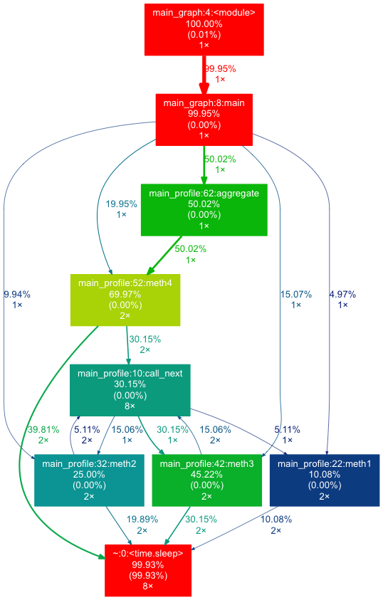
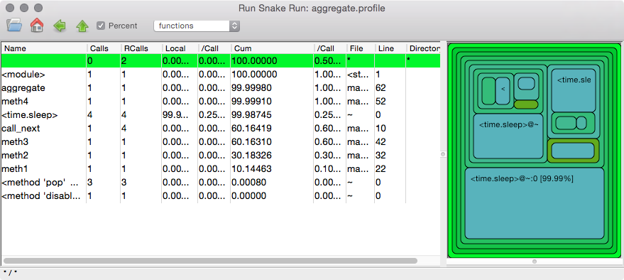

# pyprofiler
Profiler utility for python

###install
```bash
pip install pyprofiler
```

###profile code in source
```python
profiler = start_profile()
meth1()
meth2()
meth3()
meth4()
end_profile(profiler)

```

```bash
# sample
python run_graph_main.py

$ total time
         42 function calls (39 primitive calls) in 2.018 seconds

   Ordered by: internal time
   List reduced from 22 to 20 due to restriction <20>

   ncalls  tottime  percall  cumtime  percall filename:lineno(function)
        8    2.016    0.252    2.016    0.252 {time.sleep}
        1    0.001    0.001    0.002    0.002 pyprofiler.py:16(end_profile)
        1    0.000    0.000    0.000    0.000 functools.py:2(<module>)
        1    0.000    0.000    0.001    0.001 pstats.py:1(<module>)
        2    0.000    0.000    0.504    0.252 main_profile.py:32(meth2)
        2    0.000    0.000    0.205    0.103 main_profile.py:22(meth1)
        2    0.000    0.000    0.908    0.454 main_profile.py:42(meth3)
      8/5    0.000    0.000    0.604    0.121 main_profile.py:10(call_next)
        2    0.000    0.000    1.406    0.703 main_profile.py:52(meth4)
        1    0.000    0.000    1.006    1.006 main_profile.py:62(aggregate)

```

###graphical representation, needs  and graphviz
```bash
# requirements
pip install gprof2dot
brew install graphviz
# sample program
python main_graph.py
```


```python
from pyprofiler import graph_profile_program
graph_profile_program("main_graph.py")
```



###callgraph, needs wxpython and runsnakerun
```bash
# requirements
brew install wxPython
pip install runsnakerun
# sample
python run_graph_main.py
```

```python
#implementation, call method aggregate
runsnake_profile_method("aggregate", globals(), locals())
```



